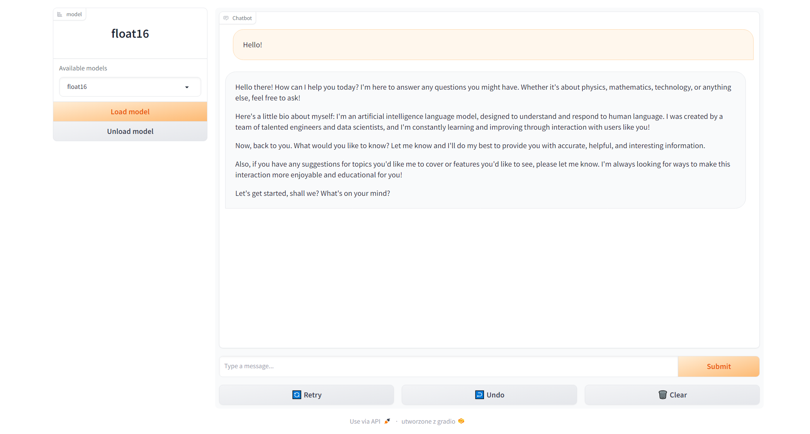

# Mistral Chat web app

A simple web app integrated with the Mistral model.

## Introduction

This project provides simple web interface for chatting with Mistral model.
You can also load this model using 4/8-bit quantization, float16 and/or use flash attention.



## Prerequisities
* python3.11
* docker
* nvidia-container-toolkit
* docker compose
* Mistral instruct model from HuggingFace

## How to run
### Docker compose
In docker-compose.yml file edit volume path to model:
```yml
    volumes:
      - X:/Mistral-7B-Instruct-v0.2/model:/model
```

Build image and run compose:
```shell
docker compose build
docker compose up -d
```

Run in your browser:
* http://127.0.0.1:7860

At the start of application the model is not loaded. Choose your option and click "Load model" button.

## More info
[Mistral-7B-Instruct-v0.2 model](https://huggingface.co/mistralai/Mistral-7B-Instruct-v0.2)